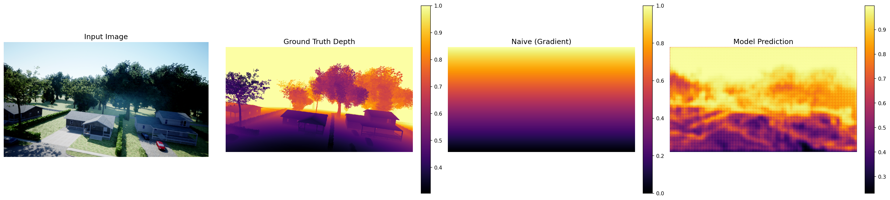
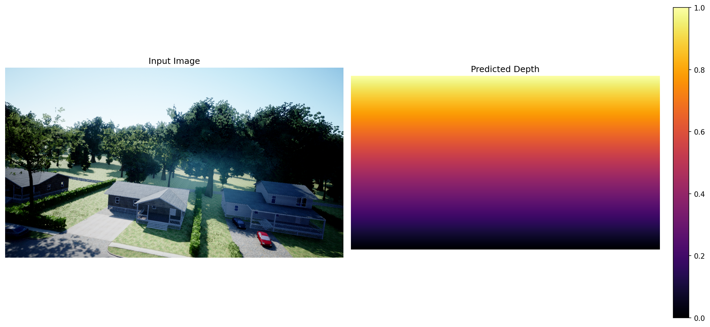
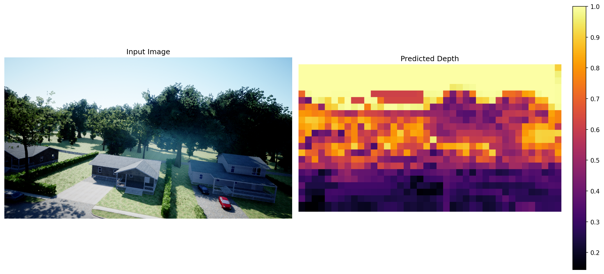
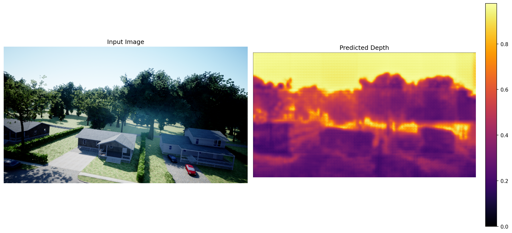

# LeDEEP: Depth Estimation with LeJEPA + SIGReg

Monocular depth estimation using a Vision Transformer encoder with LeJEPA-style multi-view self-supervised learning and SIGReg regularization.

## Setup

This project uses [uv](https://docs.astral.sh/uv/) for dependency management. Three commands to get running:

```bash
# 1. Install dependencies
uv sync

# 2. Download the DDOS dataset (~136 GB)
uv run setup

# 3. Train a model (see Quick Start for all options)
uv run train --deeplearning --epochs 50 --bs 16
```

For GPU support with CUDA 12.x on the cluster:
```bash
uv pip install torch torchvision --index-url https://download.pytorch.org/whl/cu124
```

You can also set `LEDEEP_DATA_DIR` to point to an existing dataset download instead of `data/DDOS/`.

## Quick Start

All commands are available as `uv run` scripts:

```bash
# Download the dataset (only needed once, ~3-5 GB)
uv run setup

# Train the naive baseline (mean depth predictor)
uv run train --naive --evaluate

# Train the classical ML baseline (random forest)
uv run train --classic --evaluate

# Train the supervised depth model (single-view, simpler and faster)
uv run train --supervised --epochs 50 --bs 16

# Train the LeJEPA multi-view model (richer features, slower)
uv run train --deeplearning --epochs 50 --bs 16

# Evaluate a trained model on the test set
uv run evaluate --model_path checkpoints/supervised.pt

# Run inference on a single image (auto-detects model type)
uv run infer --model_path checkpoints/supervised.pt --image_path photo.jpg

# Inference with other model types
uv run infer --model_path checkpoints/naive.pt --image_path photo.jpg --naive_mode gradient
uv run infer --model_path checkpoints/classic.joblib --image_path photo.jpg
```

## Models

This project implements four modeling approaches:

| Approach       | Command                       | Description                                                                     |
|----------------|-------------------------------|---------------------------------------------------------------------------------|
| Naive baseline | `uv run train --naive`        | Predicts the mean training depth for every pixel                                |
| Classical ML   | `uv run train --classic`      | Random forest on hand-crafted patch features (gradients, color stats, position) |
| Supervised DL  | `uv run train --supervised`   | Single-view depth supervision with SIGReg regularization (ViT or ResNet)        |
| LeJEPA DL      | `uv run train --deeplearning` | Multi-view self-supervised learning + depth supervision (ViT only)              |

### Supervised vs. LeJEPA: which should I use?

**`--supervised`** trains a standard depth estimation model: one image in, one depth map out, with SIGReg regularization on the encoder embeddings. It supports both ViT and ResNet backbones, trains faster, and is a good starting point or ablation baseline.

**`--deeplearning`** adds LeJEPA multi-view self-supervised learning on top of depth supervision. Each training image is augmented into 2 global crops (224px) and 4 local crops (96px), and the model learns to produce consistent representations across all of them. This is slower to train but encourages richer, view-invariant features. ViT only.

Use `--supervised` if you want a quick, straightforward run. Use `--deeplearning` if you want the full pipeline with self-supervised representation learning.

## Inference Server

A Flask + Gunicorn server exposes the models as a REST API for the web frontend.

### Setup

```bash
# Install server dependencies
uv sync --group server
```

### Running

```bash
# Production (from project root)
gunicorn -c server/gunicorn.conf.py server.app:app

# Development
python -m server.app
```

The server binds to `0.0.0.0:8000` by default. CORS is configured for `https://aipi540-frontend.vercel.app`.

### Endpoints

| Method | Path             | Description                            |
|--------|------------------|----------------------------------------|
| GET    | `/health`        | Server status and loaded models        |
| GET    | `/models`        | List available models and the default  |
| POST   | `/predict-depth` | Run depth inference on an uploaded image |

### `POST /predict-depth`

Send a multipart form with:

| Field   | Type   | Required | Description                                            |
|---------|--------|----------|--------------------------------------------------------|
| `image` | file   | yes      | An image file (JPEG, PNG, etc.)                        |
| `model` | string | no       | `naive`, `rf`, or `deeplearning` (auto-selects best available if omitted) |

Response:

```json
{
  "depth_map": "data:image/png;base64,...",
  "model": "deeplearning",
  "width": 1280,
  "height": 720,
  "inference_time_s": 0.842
}
```

`depth_map` is a data URI you can use directly as an `` src. The depth map is colorized with the inferno colormap.

### Model availability

The server loads whatever checkpoints are present in `checkpoints/`:

| Model          | Checkpoint needed             | Notes                    |
|----------------|-------------------------------|--------------------------|
| `naive`        | none                          | Always available         |
| `rf`           | `checkpoints/classic.joblib`  | Needs training first     |
| `deeplearning` | `checkpoints/deeplearning.pt` | Needs training first     |

### Configuration

Edit `server/gunicorn.conf.py` to change bind address, workers, threads, or timeout. The default is 1 worker with 4 threads and a 120-second timeout to accommodate model loading and large-image inference.

## Project Structure

```
.
├── pyproject.toml              # Dependencies, scripts, and project metadata
├── server/
│   ├── app.py                 # Flask inference server
│   └── gunicorn.conf.py       # Gunicorn configuration
├── src/
│   ├── cli.py                  # CLI entry points (setup, train, evaluate, infer)
│   ├── models/
│   │   └── model.py            # ViT/ResNet encoder + convolutional decoder
│   ├── data/
│   │   ├── dataset.py          # Dataset with synchronized RGB/depth transforms
│   │   ├── download.py         # Auto-download DDOS dataset from HuggingFace
│   │   └── hf_dataset.py       # HuggingFace dataset utilities
│   ├── losses/
│   │   └── loss.py             # SIGReg regularization and LeJEPA loss
│   ├── training/
│   │   ├── train_naive.py      # Naive baseline: mean depth predictor
│   │   ├── train_classic.py    # Classical ML: random forest on image features
│   │   ├── train_deeplearning.py  # Deep learning: multi-view JEPA + depth supervision
│   │   └── train_supervised.py    # Deep learning: supervised only (no multi-view)
│   ├── test/
│   │   ├── evaluate.py         # Evaluation with patch-based inference
│   │   └── inference.py        # Arbitrary-size image inference
│   ├── visualization/
│   │   ├── visualize_predictions.py  # Validation sample visualization
│   │   └── visualize_pipeline.py     # Data augmentation visualization
│   └── utils/
│       ├── metrics.py          # Depth metrics (AbsRel, RMSE, delta thresholds)
│       └── save.py             # Checkpoint saving utilities
├── slurm/                      # SLURM batch job scripts (cluster-specific)
├── checkpoints/                # Trained model checkpoints (not tracked)
└── logs/                       # Training logs (not tracked)
```

## Checkpoints

Training saves checkpoints with standardized names under `checkpoints/`:

| Model          | Default path                  | Format  | Contents                                       |
|----------------|-------------------------------|---------|------------------------------------------------|
| Naive baseline | `checkpoints/naive.pt`        | PyTorch | `mean_depth` float + metadata                  |
| Classical ML   | `checkpoints/classic.joblib`  | joblib  | Trained `RandomForestRegressor`                |
| Supervised DL  | `checkpoints/supervised.pt`   | PyTorch | Model state dict, optimizer, val metrics       |
| LeJEPA DL      | `checkpoints/deeplearning.pt` | PyTorch | Model state dict, optimizer, val metrics, args |

Override any default with `--save_path`:
```bash
uv run train --supervised --save_path checkpoints/my_experiment.pt
```

The inference script (`uv run infer`) auto-detects the model type from the checkpoint:
- `.joblib` extension → Random Forest
- `.pt` with `"type": "naive"` key → Naive baseline
- Otherwise → ViT deep learning model

## Evaluation & Inference

There are two separate scripts for testing trained models:

### `uv run evaluate` — Quantitative evaluation on the test set

Runs a ViT model over the entire test split, computes pixel-level metrics (AbsRel, RMSE), and compares against a naive gradient baseline. Saves 3 sample visualizations showing original image, ground truth, naive prediction, and model prediction side by side.

```bash
uv run evaluate --model_path checkpoints/deeplearning.pt
```

Output goes to `test_results/` by default (override with `--save_dir`).

**Sample output** (`test_results/result_0.png`):



### `uv run infer` — Inference on arbitrary images

Runs any model type on your own images (no ground truth needed). Auto-detects the model type from the checkpoint and produces a side-by-side visualization of the input and predicted depth map.

```bash
# ViT model — chunks into overlapping 224px patches, stitches back
uv run infer --model_path checkpoints/deeplearning.pt --image_path photo.jpg

# Naive baseline — vertical gradient or constant mean
uv run infer --model_path checkpoints/naive.pt --image_path photo.jpg --naive_mode gradient

# Random Forest — predicts per-patch depth from hand-crafted features
uv run infer --model_path checkpoints/classic.joblib --image_path photo.jpg
```

Output goes to `inference_results/` by default (override with `--output_dir`). Also accepts a directory of images.

**Sample outputs:**

| Naive (gradient)                                      | Random Forest                                | ViT (LeJEPA)                                   |
|-------------------------------------------------------|----------------------------------------------|------------------------------------------------|
|  |  |  |

## Architecture

The deep learning model uses a pretrained **ViT-Small** (patch size 16, ImageNet-21k) encoder that produces:
- **Patch tokens** (14x14 spatial grid) fed to a progressive convolutional decoder for dense depth prediction
- **CLS token** projected into a 512-dim embedding space for the JEPA objective

The decoder upsamples through 4 stages of transposed convolutions (14x14 -> 224x224) to produce a single-channel depth map normalized to [0, 1].

### Training Details

The deep learning model uses a composite loss: `depth_weight * ScaleInvariantLoss + jepa_weight * LeJEPA_Loss`

The LeJEPA training paradigm generates 2 global views (224x224) and 4 local views (96x96) per image, with synchronized transforms applied to both RGB and depth. SIGReg regularization prevents representation collapse by encouraging the embedding space to follow a standard Gaussian distribution.

## Dataset

**DDOS (Depth from Driving Open Scenes)**: [benediktkol/DDOS](https://huggingface.co/datasets/benediktkol/DDOS)

- Downloaded automatically via `uv run setup` (~3-5 GB)
- Resolution: 1280x720 paired RGB + 16-bit depth maps
- Depth normalization: `depth / 65535.0` -> [0, 1]
- Train/val split: 95/5
- Default location: `data/DDOS/` (override with `LEDEEP_DATA_DIR`)

## SLURM Scripts

The `slurm/` directory contains batch job scripts for running on the Duke compsci-gpu cluster. These are cluster-specific and hardcode partition names and GPU types. Adjust the `source` paths and `--gres` flags for your environment.

## References

- [LeJEPA: SIGReg for Self-Supervised Learning](https://arxiv.org/abs/2511.08544) (Balestriero et al., 2025)
- [I-JEPA: Joint Embedding Predictive Architecture](https://arxiv.org/abs/2301.08243) (Assran et al., 2023)
- [Scale-Invariant Loss for Depth Prediction](https://arxiv.org/abs/1406.2283) (Eigen et al., 2014)
- [VICReg: Variance-Invariance-Covariance Regularization](https://arxiv.org/abs/2306.13292) (Zhu et al., 2023)
